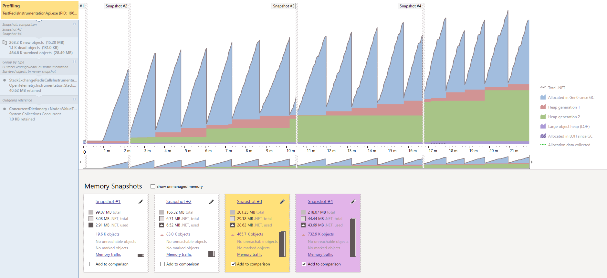
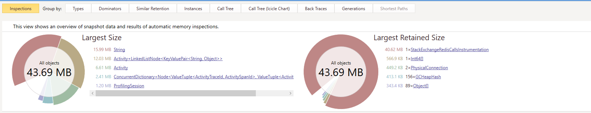
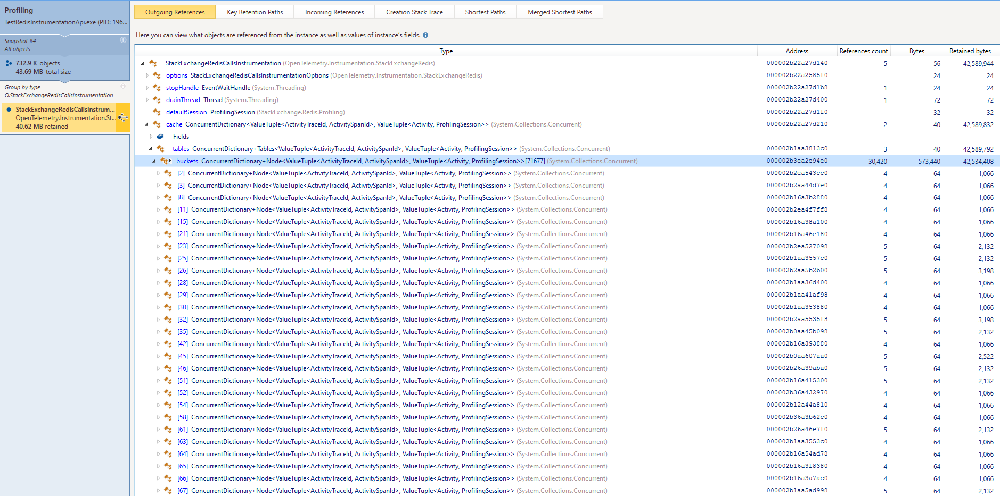

# test-redis-instrumentation

## Getting started

Clone the repository:
```
git clone https://github.com/jessica-mottner-cko/test-redis-instrumentation.git
```

In `test-redis-instrumentation` folder:

1) run the docker compose 

```
docker-compose up -d
```

To start redis, redis-ui and zipkin.

2) run the project the api

```
dotnet run --project TestRedisInstrumentationApi/TestRedisInstrumentationApi.csproj
```

3) Run the memory profiler of your choice (attach to your running process)


4) Run the client

```
dotnet run --project TestRedisInstrumentationClient/TestRedisInstrumentationClient.csproj 50000
```

First argument defines the number of iterations.

## Memory Profiler Screenshots

Overview:


Retained Size:


Detailed View:


